[](https://github.com/Charly21r/content-moderation-system/actions/workflows/ci.yaml)
[](https://github.com/Charly21r/content-moderation-system/actions/workflows/model-validation.yaml)


# Argus

Production-grade, multimodal content moderation system for real-time toxicity and hate-speech detection — with built-in fairness enforcement.

---

## Overview

Argus detects toxic and hateful content across three modalities:

| Modality | Status |
|---|---|
| Text (comments, posts, messages) | **Available** |
| Image (screenshots, photos) | In progress |
| Multimodal (memes: text + image) | In progress |

All models share a unified output schema, designed for plug-in integration with Trust & Safety dashboards, real-time moderation APIs, and enterprise safety pipelines.

---

## Key Features

- **Multi-label classification** — simultaneous toxicity + hate detection per input
- **Transformer-based text model** — DistilBERT fine-tuned on Jigsaw Toxic Comments
- **Threshold calibration** — per-label F1-optimal thresholds, not hard 0.5 defaults
- **Fairness-aware evaluation** — slice-level FPR/TPR across identity groups with CI enforcement
- **Counterfactual augmentation** — synthetic identity-swapped examples to reduce lexical bias
- **MLflow tracking** — full reproducibility with artifact and metric logging
- **REST API** — FastAPI serving layer with structured request/response schemas
- **Containerized** — Docker + Docker Compose for local and production deployment
- **Observability** — Prometheus metrics + Grafana dashboards

---

## Architecture

```
                        ┌─────────────────────────────────┐
                        │           Argus API              │
                        │         (FastAPI / REST)         │
                        └────────────┬────────────────────┘
                                     │
              ┌──────────────────────┼───────────────────────┐
              ▼                      ▼                        ▼
     ┌────────────────┐   ┌──────────────────┐   ┌──────────────────────┐
     │  Text Model    │   │  Image Model     │   │  Multimodal Model    │
     │  (DistilBERT)  │   │  (ViT / CNN)     │   │  (text + image enc.) │
     │                │   │  [in progress]   │   │  [in progress]       │
     └────────────────┘   └──────────────────┘   └──────────────────────┘
              │
     ┌────────────────┐
     │ Unified Output │   { id, text/image, toxicity, hate, safe, latency_ms }
     └────────────────┘
```

---

## Quickstart

**Requirements:** Python 3.11+, Docker

### Run locally with Docker Compose

```bash
docker compose up
```

| Service | URL |
|---|---|
| Argus API | http://localhost:8000 |
| API docs (Swagger) | http://localhost:8000/docs |
| MLflow | http://localhost:5001 |
| Prometheus | http://localhost:9090 |
| Grafana | http://localhost:3000 |

### Run API directly

```bash
pip install -e ".[serving]"
make serve
```

### Moderate a piece of text

```bash
curl -X POST http://localhost:8000/v1/moderate/text \
  -H "Content-Type: application/json" \
  -d '{"id": "1", "content": "Your text here"}'
```

Response:

```json
{
  "id": "1",
  "text": "Your text here",
  "toxicity": { "label": "toxicity", "score": 0.03, "flagged": false },
  "hate":     { "label": "hate",     "score": 0.01, "flagged": false },
  "safe": true,
  "processing_time_ms": 18.4
}
```

---

## Training

```bash
pip install -e ".[training]"

# Preprocess Jigsaw dataset
python src/data/jigsaw_preprocessing.py

# Train text model (logs to MLflow)
python src/training/train_text_model.py

# Generate bias evaluation templates
python scripts/generate_bias_templates.py

# Run bias evaluation
python scripts/run_bias_eval.py
```

---

## Fairness & Bias Evaluation

Content moderation models are prone to **lexical bias** — disproportionately flagging content that merely mentions certain identity groups (e.g., "muslim", "gay", "woman") as toxic.

Argus addresses this with a three-layer pipeline:

### 1. Synthetic Templated Dataset
Controlled toxic/non-toxic examples generated by swapping identity terms across a fixed template. This isolates lexical bias from genuine toxicity signal.

### 2. Slice-Level Metrics
For each identity group, the bias report (`models/text_toxicity/artifacts/bias_report.json`) records:
- False Positive Rate (FPR) and True Positive Rate (TPR)
- ROC-AUC and PR-AUC
- Delta metrics vs. the non-group baseline (e.g. ΔFPR)

### 3. CI Fairness Gate
`tests/test_bias_constraints.py` enforces:
- No group's ΔFPR may exceed **5 percentage points**
- No extreme TPR divergence between groups

A failing fairness test **blocks model promotion** in CI.

---

## API Reference

| Method | Endpoint | Description |
|---|---|---|
| `GET` | `/v1/health` | Liveness check |
| `GET` | `/v1/model/info` | Loaded model metadata |
| `POST` | `/v1/moderate/text` | Moderate a text input |

Full interactive docs at `/docs` when the server is running.

---

## Output Schemas

**Text**
```json
{
  "id": "string",
  "text": "string",
  "toxicity": { "label": "toxicity", "score": 0.0, "flagged": false },
  "hate":     { "label": "hate",     "score": 0.0, "flagged": false },
  "safe": true,
  "processing_time_ms": 0.0
}
```

**Multimodal** *(training-time schema)*
```json
{
  "id": "string",
  "text": "string",
  "image_path": "data/raw/...",
  "hate": 0,
  "source": "hateful_memes"
}
```

---

## Datasets

| Dataset | Modality | Used for |
|---|---|---|
| [Jigsaw Toxic Comments](https://www.kaggle.com/c/jigsaw-toxic-comment-classification-challenge) | Text | Text model training |
| [Facebook Hateful Memes](https://ai.meta.com/tools/hatefulmemes/) | Multimodal | Multimodal model *(in progress)* |
| [MMHS150K](https://gombru.github.io/2019/10/09/MMHS/) | Multimodal | Multimodal model *(in progress)* |

---

## Tech Stack

| Layer | Technology |
|---|---|
| Model | PyTorch, HuggingFace Transformers |
| Training tracking | MLflow |
| Serving | FastAPI, Uvicorn |
| Containerization | Docker, Docker Compose |
| Observability | Prometheus, Grafana |
| Testing | pytest |
| Linting / types | Ruff, mypy |
| CI | GitHub Actions |

---

## Repo Structure

```
.
├── assets/                     # Logos and static assets
├── config/
│   └── local_sensitive_words.json
├── data/
│   ├── raw/jigsaw/
│   ├── preprocessed/text/
│   └── bias_eval/
├── models/
│   └── text_toxicity/artifacts/
├── monitoring/
│   └── prometheus/
├── notebooks/
├── reports/
├── scripts/
│   ├── generate_bias_templates.py
│   └── run_bias_eval.py
├── src/
│   ├── data/
│   ├── serving/
│   ├── training/
│   └── utils/
└── tests/
```

---

## Development

```bash
make install     # install all deps in dev mode
make test        # run full test suite
make lint        # ruff check
make typecheck   # mypy
make format      # auto-format
make test-bias   # fairness constraint tests (requires model artifacts)
```
